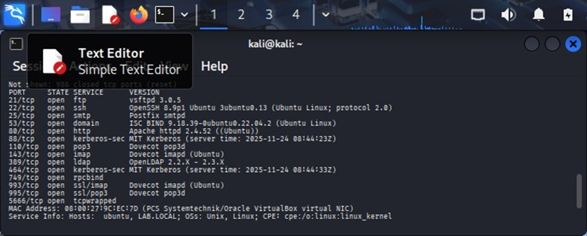

# Simulated Enterprise Security Assessment & Hardening Lab

## Objective
Design, assess, and secure a simulated multi-service environment to identify vulnerabilities and implement defensive security controls.

## Environment
- Virtual lab environment (VirtualBox/VMware)
- Linux Server (Ubuntu/CentOS)
- Attacker machine: Kali Linux

## Services Deployed
- SSH
- FTP/SFTP
- HTTP/HTTPS (Apache/Nginx)
- MySQL/MariaDB
- DNS/DHCP
- SMTP/IMAP
- Firewall (UFW/Iptables)
- Fail2Ban
- Syslog

## Phase 1: Security Assessment (Pre-Hardening)
- Nmap network scan to identify exposed ports
- Service enumeration
- Weak authentication testing
- Basic vulnerability scanning

- ### Nmap Scan Results (Before Hardening)

## Phase 2: Hardening Implementation
- Firewall rules configured
- Disabled unnecessary services
- Enforced strong password policies
- Applied system updates
- Implemented Fail2Ban
- Log monitoring enabled

## Validation
Post-hardening scan demonstrated reduced attack surface and improved security posture.

## Key Skills Demonstrated
- Network enumeration
- Vulnerability assessment
- Service hardening
- Defensive configuration
- Log analysis

## Lessons Learned
During the offensive phase, the environment was assessed to identify exploitable weaknesses. Using Nmap, open ports and exposed services were discovered. Weak authentication mechanisms were tested with Hydra, targeting services such as SSH, FTP, Telnet, IMAP, and POP3.

Unencrypted protocols like FTP were analyzed with Wireshark, allowing credential interception in clear text. The environment lacked defensive configurations: unnecessary services were enabled, default settings remained active, password policies were weak, and no firewall or Fail2Ban protections were implemented.

In the defensive phase, the system was hardened by reducing exposed services and enabling a firewall with strict port control. Weak password policies were replaced with stronger authentication requirements.
